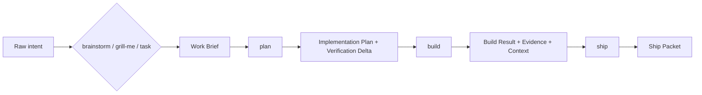

# vibe-engineer

`vibe-engineer` is intent-driven engineering with structure: a domain-neutral harness for agent-native TypeScript work where ideas become artifacts, verification runs as part of the workflow, and context survives beyond chat.

It is not "vibe coding." It is the system around the work: skills, schematics, deterministic primitives, evidence, and memory.

## Release status

`vibe-engineer` is a v0.1 release candidate. The local release proof now covers:

- `tsup`-built Node LTS-compatible `dist` output;
- the publishable public package graph: `vibe-engineer` plus public `@vibe-engineer/*` packages;
- installed-package CLI smoke through a clean external tarball install;
- the v0.1 CLI primitive set: `help`, `version`, `create`, `import`, `doctor`, `config`, `verify`, `security`, `schematic`;
- `vibe-engineer create` generating the full starter plus pi-native skill/prompt assets;
- generated starter install, typecheck, lint, format check, unit tests, build, and quick quality.

Publication is still manual/protected. Do not treat npm publication as complete until `pnpm release:publish` has run in the protected release context with valid npm authentication.

## Install after publication

```bash
npm install --save-dev vibe-engineer
npx vibe-engineer help
```

For local release proof before npm publication, use the release scripts below.

## Create a starter

After installing the package, create a project with the pi harness assets:

```bash
npx vibe-engineer create --target-root ./my-project --project-name my-project --agentic-harness pi --non-interactive
```

The generated starter contains NestJS API, React web, React Native mobile, shared packages, `.vibe/**` context/work/evidence/registry scaffolding, `.tooling/**`, and pi-native assets for all six skills.

## The workflow

Start with intent. End with a reviewable Ship Packet.



The six user-facing skills are installed as harness-native assets, not as `vibe-engineer` CLI commands. The public CLI exposes deterministic primitives for agents, CI, debugging, and starter generation.

## Release proof scripts

```bash
pnpm build
pnpm test
pnpm quality -- --profile=ci --evidence-dir /tmp/vibe-quality/evidence --summary-out /tmp/vibe-quality/summary.json
pnpm release:pack
pnpm release:install-smoke
pnpm release:check
```

Publishing is intentionally protected:

```bash
VIBE_ENGINEER_RELEASE_APPROVED=true pnpm release:publish -- --confirm-publish
```

`release:publish` verifies GitHub/npm identity before publishing and refuses to publish without the explicit confirmation flag plus approval environment variable.

## Read next

- [Create a project](./docs/guides/getting-started/create-project.md)
- [Detailed workflow guide](./docs/guides/getting-started/workflow.md)
- [Repository status](./docs/guides/getting-started/repository-status.md)
- [CLI reference](./docs/reference/cli.md)
- [Package exports](./docs/reference/packages.md)
- [Documentation index](./docs/README.md)

## Governance

- [License](./LICENSE)
- [Contributing](./CONTRIBUTING.md)
- [Code of Conduct](./CODE_OF_CONDUCT.md)
- [Security](./SECURITY.md)
- [Changelog](./CHANGELOG.md)
