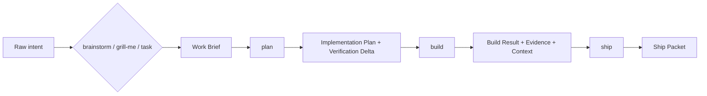

# vibe-engineer

`vibe-engineer` is intent-driven engineering with structure: a domain-neutral harness for agent-native TypeScript work where ideas become artifacts, verification runs as part of the workflow, and context survives beyond chat.

It is not "vibe coding." It is the system around the work: skills, schematics, deterministic primitives, evidence, and memory.

## The workflow

Start with intent. End with a reviewable Ship Packet.

### 1. Shape the work

Use one of the intake skills:

- `brainstorm` explores an unclear idea.
- `grill-me` pressure-tests assumptions, risks, and gaps.
- `task` captures a direct request, bug, chore, or small change.

All three produce the same durable artifact: a **Work Brief**.

### 2. Plan the proof

`plan` consumes a Work Brief and writes an **Implementation Plan** with a **Verification Delta**: what must be added, updated, reused, ruled out, or blocked across the verification catalog.

### 3. Build with evidence

`build` consumes an approved plan, implements the change, builds required verification, runs deterministic checks, captures evidence, and updates context. Its output is a **Build Result**.

### 4. Ship only after proof

`ship` consumes a Build Result, runs final verification/context checks, and prepares a **Ship Packet**. It may prepare commit/PR text, but it must not push or open a PR without explicit approval.

## What lives where

`vibe-engineer` is the harness repo: the reusable engine for skills, artifact schemas, CLI primitives, schematics, verification, context, registries, standards, adapters, and docs.

`vibe-engineer-starter` is the planned generated/reference starter repo. It consumes the harness; it is not a copied fork of harness logic.

## Skills vs schematics vs CLI

- **Skills** are the user-facing workflow: `brainstorm`, `grill-me`, `task`, `plan`, `build`, `ship`.
- **Schematics** are internal/agent-facing generators for consistent structure.
- **CLI primitives** are deterministic machinery for agents, CI, debugging, and skill implementations.

Normal users should not have to run low-level verification, context, or schematic commands during ordinary work.

## Current status

This repository is still foundation/skeleton work. Package workspace files and early package lanes exist, but the public package, live CLI, generated starter, skill runtime, docs site, install/create commands, release automation, and end-to-end workflow are not claimed as live here.

So this README intentionally does **not** include install or create snippets yet. When commands are proven by real binary/package witnesses, the docs will show them.

See [repository status](./docs/guides/getting-started/repository-status.md) for the detailed state and release blockers.

## Read next

- [Detailed workflow guide](./docs/guides/getting-started/workflow.md)
- [Repository status and release blockers](./docs/guides/getting-started/repository-status.md)
- [Documentation index](./docs/README.md)
- [Architecture overview](./docs/architecture/index.md)
- [Skill protocols decision](./docs/decisions/DL-03-skill-protocols.md)
- [CLI primitives decision](./docs/decisions/DL-07-cli-primitives.md)
- [Documentation system decision](./docs/decisions/DL-21-documentation-system.md)
- [Domain-neutrality foundation](./docs/decisions/DL-20A-domain-neutrality-foundation.md)

## Governance

- [License](./LICENSE)
- [Contributing](./CONTRIBUTING.md)
- [Code of Conduct](./CODE_OF_CONDUCT.md)
- [Security](./SECURITY.md)
- [Changelog](./CHANGELOG.md)

Public release is blocked until governance placeholders, real package metadata, release evidence, and live workflow claims are resolved by their owning lanes.
