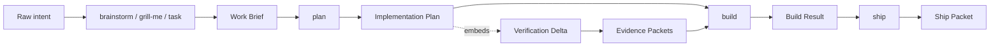

# Artifact chain

The `vibe-engineer` workflow moves work through durable, validated artifacts. This page describes the canonical chain, the artifact kinds, and where each is defined and validated in the actual source.

## The chain

```txt
raw intent → Work Brief → Implementation Plan → Build Result → Ship Packet
```

A Verification Delta is embedded in the Implementation Plan and produces Evidence Packets during `build`/`ship`. Context headers/index entries are produced alongside artifacts so future agents can recover closure.



## Six user-facing skills

Exactly six skills are locked (source: `packages/registry/src/index.js`, `LOCKED_SKILLS`):

```txt
brainstorm, grill-me, task, plan, build, ship
```

- `brainstorm`, `grill-me`, `task` — input skills. Each produces a **Work Brief**.
- `plan` — consumes a Work Brief, produces an **Implementation Plan** that embeds a **Verification Delta**.
- `build` — consumes an approved Implementation Plan, runs verification, emits **Evidence Packets** + **Build Result** + context updates.
- `ship` — consumes a Build Result, runs final proof, produces a **Ship Packet**. Does **not** push/PR without explicit approval.

> **pending-live.** Skill names are the locked protocol, not proven runnable shell commands. The skill runtime is not wired yet.

## Artifact kinds (actual)

The canonical artifact kinds are defined in `packages/artifacts/src/schema-registry.js` (`ARTIFACT_KINDS`) and validated by JSON Schema files under `packages/artifacts/schemas/`:

| Artifact kind | Schema file | Produced by |
| --- | --- | --- |
| `work_brief` | `schemas/work-brief.schema.json` | input skills |
| `implementation_plan` | `schemas/implementation-plan.schema.json` | `plan` |
| `verification_delta` | `schemas/verification-delta.schema.json` | `plan` (embedded in plan) |
| `build_result` | `schemas/build-result.schema.json` | `build` |
| `ship_packet` | `schemas/ship-packet.schema.json` | `ship` |
| `evidence_packet` | `schemas/evidence-packet.schema.json` | verification runner |
| `agent_registry_entry` | `schemas/agent-registry-entry.schema.json` | registry authoring |
| `context_file_header` | `schemas/context-file-header.schema.json` | context writer |
| `schematic_manifest` | `schemas/schematic-manifest.schema.json` | schematic authoring |
| `skill_manifest` | `schemas/skill-manifest.schema.json` | skill authoring |

All schemas share `SUPPORTED_SCHEMA_VERSION = '1.0.0'`. See [Schemas reference](../reference/schemas.md) for validation API.

## Validation seam

Artifacts are never trusted as prose. The `@vibe-engineer/artifacts` package exposes a typed boundary:

```js
import {
  ARTIFACT_KINDS,
  validateArtifact,
  validateArtifactFile,
  validateArtifactKind,
  loadSchema,
  loadAllSchemas
} from "@vibe-engineer/artifacts";
```

- `validateArtifactKind(kind, value)` — validates an in-memory object against a kind's schema; returns `{ ok, errors }`.
- `validateArtifactFile(path, { kind })` — reads and validates a file; on success returns `{ ok, artifact }`.
- `loadSchema(kind)` / `loadAllSchemas()` — load the canonical JSON Schema source.

This seam is consumed by the verification runner, which validates the Implementation Plan and the embedded Verification Delta before executing any required item, and validates every Evidence Packet candidate before it is persisted (see [Verification model](./verification-model.md)).

## Handoff invariants

From the locked direction and the actual runner source:

- An Implementation Plan must be `status: "approved"` and must embed a `verification_delta` artifact before `build` can run (`packages/verification/src/index.js`, `runVerificationPlan`).
- Every Verification Delta `requiredItem` declares one action from `add | update | reuse | not_applicable | blocked`.
- Evidence Packets carry an `evidenceClass` (`deterministic | advisory | informational`), a `layer`, a `result`, and — on failure — a typed `failureDetails` with a stable `classification`.
- `ship` does not push/PR without explicit approval.

## Related

- [Verification model](./verification-model.md)
- [Schemas reference](../reference/schemas.md)
- [DL-02 — Artifact Schemas](../decisions/DL-02-artifact-schemas.md)
