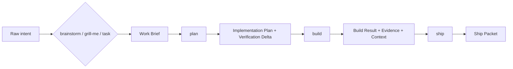

# Workflow guide

This guide is the detailed companion to the short product README. It describes the `vibe-engineer` workflow and separates v0.1 live primitives from harness-native skill runtime that remains adapter-driven.

`vibe-engineer` is a domain-neutral harness for serious TypeScript projects. Its job is to move software work through durable artifacts, deterministic primitives, automatic verification, and preserved context so future agents can understand what changed, why it changed, and how to change it safely again.

## Current implementation truth

The v0.1 deterministic CLI primitives and generated starter path are published and locally proven from packed packages plus a clean external install. Create new projects with `npx vibe-engineer@latest create ...`, then use `pnpm exec vibe-engineer ...` inside the generated repo; global install is optional for power users. The six user-facing skills are installed as harness-native assets for the selected harness (pi in v0.1); they are not `vibe-engineer` shell commands.

The complete live skill orchestration loop (`brainstorm` / `grill-me` / `task` → `plan` → `build` → `ship`) remains adapter/runtime work unless invoked through generated harness-native assets and supported by evidence. Do not document the six skill names as CLI commands.

## Two-repo model

`vibe-engineer` uses a two-repo direction:

- **Harness repo**: `vibe-engineer`, the reusable engine. It owns artifact schemas, CLI primitives, schematics, skills, orchestration, verification, context, registries, standards, agentic harness adapters, governance, and docs.
- **Generated/reference starter repo**: `vibe-engineer-starter`, the planned generated/reference starter. It consumes the harness through package/config/generated assets instead of copying harness implementation logic.

The starter repo demonstrates the intended workflow and default project shape. The harness repo remains domain-neutral and reusable across project domains.

## Workflow at a glance



The artifact chain is:

```txt
raw intent → Work Brief → Implementation Plan → Build Result → Ship Packet
```

Each handoff is meant to be persisted and validated. Raw chat is not the source of truth.

## The six user-facing skills

Normal users operate through exactly six skills:

| Skill        | Role                                                                                        | Produces                                 |
| ------------ | ------------------------------------------------------------------------------------------- | ---------------------------------------- |
| `brainstorm` | Explore and shape unclear ideas, options, tradeoffs, and unknowns.                          | Work Brief                               |
| `grill-me`   | Pressure-test assumptions, risks, edge cases, and acceptance gaps.                          | Work Brief                               |
| `task`       | Normalize a direct request, bug, chore, refactor, research item, or decision request.       | Work Brief                               |
| `plan`       | Convert one Work Brief into a buildable plan and proof strategy.                            | Implementation Plan + Verification Delta |
| `build`      | Implement the plan, construct required verification, run checks, preserve evidence/context. | Build Result                             |
| `ship`       | Run final proof, preserve handoff context, and prepare release/review material.             | Ship Packet                              |

### Input skills produce Work Briefs

`brainstorm`, `grill-me`, and `task` all write the same Work Brief artifact class. They can capture candidate acceptance scenarios, candidate E2E cases, UI states, unknowns, reproduction notes, and constraints.

They do **not** own final risk classification, final sensitive-area analysis, implementation, shipping, or remote publication.

### `plan` owns the Verification Delta

`plan` consumes exactly one valid Work Brief. It writes an Implementation Plan containing the task scope, affected areas, context closure, sequencing, acceptance criteria, Definition of Done, and a machine-readable Verification Delta.

The Verification Delta answers: what new or changed verification is required for this task?

For each relevant verification category, planning must classify the work as one of:

- `add` — new verification is required;
- `update` — existing verification must change;
- `reuse` — existing verification already covers the work;
- `not applicable` — the category does not apply, with a reason;
- `blocked` — required verification cannot be implemented until a prerequisite exists.

Silent gaps are not allowed. If a verification category matters, the plan must say how it is handled.

### `build` implements behavior and proof

`build` consumes an approved Implementation Plan only. It is responsible for both the requested change and the verification layer required for that change.

A complete build is expected to:

- load the required context closure;
- use schematics where appropriate;
- implement code and documentation/context changes;
- add or update tests, checks, fixtures, gates, or evidence capture;
- run deterministic verification automatically;
- route failures to appropriate fixers;
- capture command/output evidence;
- update context so future agents can resume safely;
- write a Build Result.

A build that changes behavior without required verification is incomplete.

### `ship` finalizes only after proof

`ship` consumes a Build Result only. It runs final verification/context checks, audits evidence, summarizes changes, prepares commit/PR material, and writes a Ship Packet.

`ship` must not push, open a PR, publish, or perform equivalent remote action without explicit user approval and the relevant future security/adapter support.

## Schematics are helpers, not skills

Schematics are deterministic generators used by agents and skills to avoid hand-writing repetitive structure. Examples include module, adapter, contract, test, context, standard, or skill scaffolds.

They are internal/agent-facing by default. A human should not need to choose low-level schematics during ordinary work. The intended flow is:

```txt
user intent → skill/orchestrator → agent chooses schematic → structure is generated → agent fills specifics
```

## CLI primitives are the engine layer

The CLI namespace and binary are `vibe-engineer`, but the CLI is not the primary human workflow.

The v0.1 CLI primitive layer is for deterministic process boundaries: creation/import, schematics, verification, security checks, config inspection, doctor diagnostics, help, and version output.

```txt
help version create import doctor config verify security schematic
```

Automation must consume typed machine output and persisted artifacts, not prose logs or chat history. Deferred command families (`context`, `registry`, `update`, `init`) fail closed until separately implemented and proven.

## Verification model

Verification is part of the work, not an afterthought.

Locked principles:

- deterministic checks block;
- advisory review can help but does not replace proof;
- evidence beats assertion;
- `build` and `ship` run verification/context/evidence behavior automatically once implemented;
- tests target required behavior, acceptance criteria, risks, sensitive paths, and regressions rather than vanity line coverage alone;
- context/drift checks are part of the verification model.

The full catalog includes safety hooks, type checks, lint/format/boundary rules, mechanical quality gates, unit tests, integration tests, contract/adapter tests, E2E tests, UI verification, AI evals where applicable, build/package checks, context/drift checks, observability checks when required, advisory reviews, and final Definition-of-Done checks.

## Mechanical quality gates

The locked mechanical gate families are:

- governed quality surface;
- strict configuration guards;
- escape/suppression allowlists;
- schema/contract strictness;
- quality ratchet;
- quality wiring integrity;
- code-smell detection;
- test anti-pattern scanning.

These gates make fake-green quality harder. A green tool result is not enough if the checked surface is incomplete, configs can silently weaken, or tests prove only smoke.

## Context preservation

The harness preserves memory through artifacts and context, not raw conversation history.

Future agents should be able to answer:

- what exists;
- why it exists;
- who owns it;
- what depends on it;
- how to verify a safe change;
- which plans, decisions, standards, and evidence matter.

The context system includes root and per-area context, work artifacts, graph/indexing, drift detection, and APIs for safe context closure. Generated starters receive `.vibe/context`, `.vibe/work`, `.vibe/evidence`, and `.vibe/registry` scaffolding. Automatic context updates during full `build`/`ship` orchestration remain part of the harness-native skill workflow.

## Domain-neutrality

Core harness surfaces must stay reusable. Core docs, prompts, schematics, validators, standards, packages, and generated defaults may talk about apps, packages, modules, contracts, adapters, tests, standards, context, plans, verification, schematics, skills, agents, artifacts, and evidence.

Project-specific vocabulary belongs in consuming-project extensions or explicitly labeled sample/demo/reference fixtures, not hidden harness defaults.

## Current status and pending-live proof

The v0.1 package/create/starter path is locally proven. Live pi runtime loading, provider-agnostic Pulumi Cloud preview/up, web visual baselines, and iOS Maestro+Detox mobile smoke have local evidence. Hosted CI proof is tracked separately until GitHub Actions run evidence exists.

For current repository state and release proof, see [repository status](./repository-status.md).

## Decision links

- [Documentation index](../../index.md)
- [Architecture overview](../../architecture/index.md)
- [DL-01 — Repository and Package Structure](../../decisions/DL-01-repo-package-structure.md)
- [DL-03 — Skill Protocols](../../decisions/DL-03-skill-protocols.md)
- [DL-07 — CLI Primitives](../../decisions/DL-07-cli-primitives.md)
- [DL-20A — Domain-Neutrality Foundation](../../decisions/DL-20A-domain-neutrality-foundation.md)
- [DL-21 — Documentation System](../../decisions/DL-21-documentation-system.md)
- [DL-24A — Planning Output Discipline](../../decisions/DL-24A-planning-output-discipline.md)
